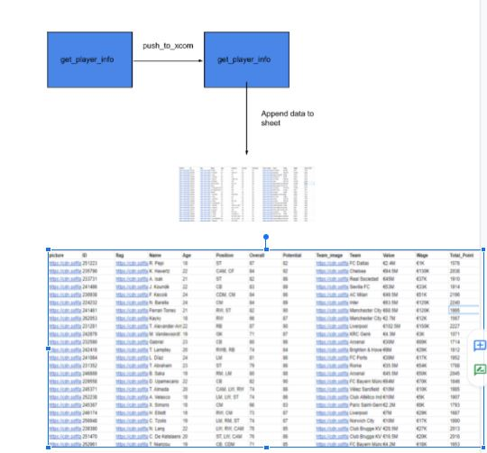
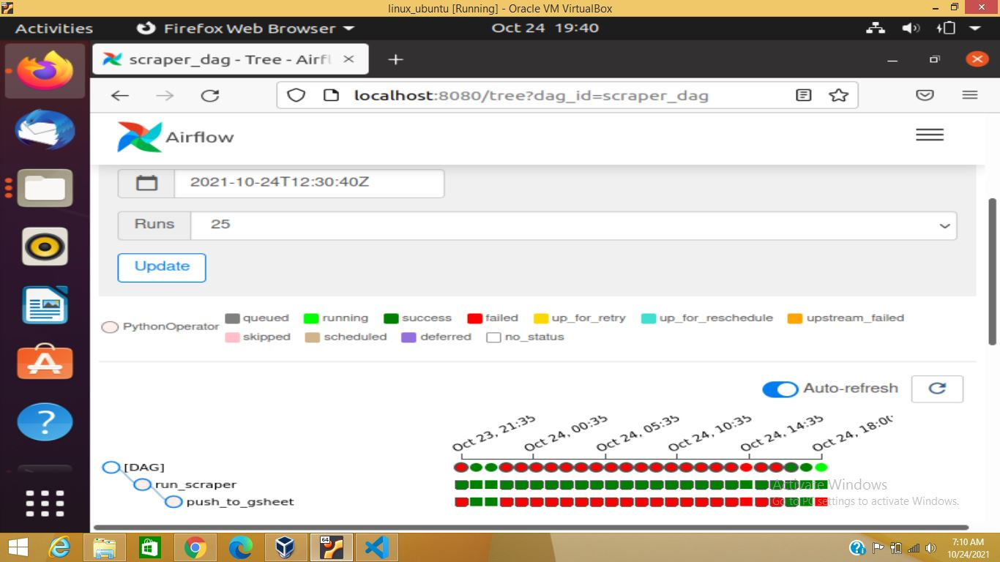

### Automating web scraping task with Apache airflow

This is a High level document which  discusses how we can automate daily web scraping tasks with apache airflow and monitor them easily.

Tools & language used

Python 

Apache airflow 2.2.0

Google sheet with gspread.

bs4.

**Description of tools**

|**Tools & Language**|**Use Case**|
| :- | :- |
|Python|With the help of python we wrote scraping method, method to push data to google sheet|
|Apache airflow 2.2.0|To automate pipeline|
|Google sheet with gspread|Use it as Database, gspread helps us to communicate with google sheet via python |
|bs4|Python library used for parsing html code and getting data.|

Description of Function used

get\_player \_info = used in beautifulsoup4 and hence provides data in the form list of dict. Where each dict contain keys value pair, which hold required data.

update\_gsheet = this function used to use scrapped data and append this data to google sheet.

With the help of the sheet API, we are communicating with google sheet and python.

**Operator:**

**Python Operator:** Python operator used to execute python callable, in our case we are using two python callable get\_player\_info, update\_sheet.

**Flow**

**Airflow**

question and asnwer

1. How to get api access for google sheet?

`      `Answer: You can get it from <https://developers.google.com/sheets/api> 

2. ` `Can we use the database as well?

`     `Answer Yes, Airflow comes with a different different operator which can help us to insert data    to db of your choice. In my case, I tried to keep things as simple as I can.

3. `` Why so many failed at pushed_to_gsheet?  
`    `Answer: For free tier google sheet API have limit for per minute call, which is causing stream to get fail.

